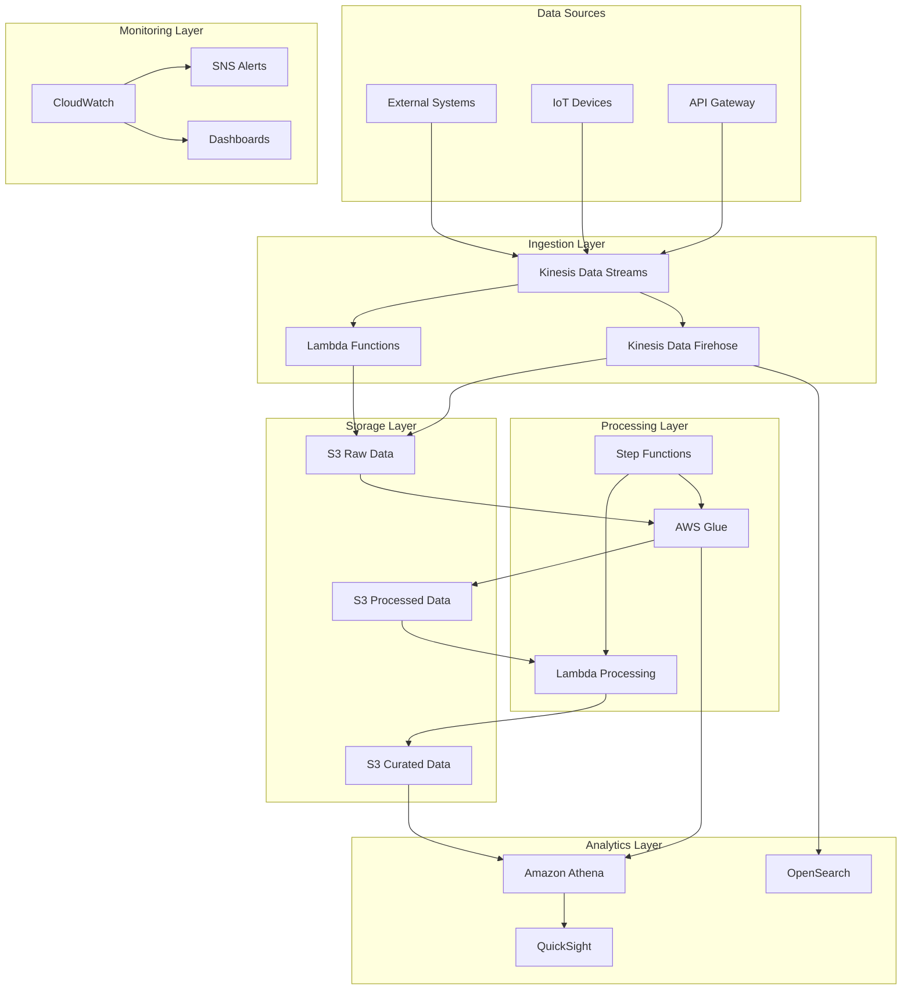

# AWS Serverless Data Platform

[](https://github.com/mindbuttergold/aws-data-platform/actions/workflows/github-code-scanning/codeql) [](https://scorecard.dev/viewer/?uri=github.com/mindbuttergold/aws-data-platform)

A comprehensive, production-grade serverless data platform built on AWS using Infrastructure as Code (IaC) best practices. This platform provides a complete data lake architecture with real-time streaming, batch processing, data cataloging, analytics, and monitoring capabilities.

## 🏗️ Architecture Overview

The platform is built using a modern, scalable, and secure serverless architecture consisting of 8 core components:



### Core Components

1. **Networking** - VPC, subnets, security groups, and network ACLs
2. **Security** - IAM roles, KMS encryption, and security policies
3. **Storage** - S3 data lake with multiple tiers (raw, processed, curated)
4. **Data Catalog** - AWS Glue databases, crawlers, and ETL jobs
5. **Streaming** - Kinesis Data Streams, Firehose, and real-time analytics
6. **Orchestration** - Step Functions, Lambda, and MWAA (Airflow)
7. **Analytics** - Athena, QuickSight, and OpenSearch
8. **Monitoring** - CloudWatch, SNS alerts, and comprehensive dashboards

## 🚀 Quick Start

### Prerequisites

- AWS CLI configured with appropriate permissions
- Terraform >= 1.5.0
- Terragrunt >= 0.50.0
- Python 3.9+
- Go 1.21+ (for testing)

### Installation

1. **Clone the repository**
   ```bash
   git clone https://github.com/your-org/aws-serverless-data-platform.git
   cd aws-serverless-data-platform
   ```

2. **Configure AWS credentials**
   ```bash
   aws configure
   # or use AWS SSO, IAM roles, or environment variables
   ```

3. **Update configuration files**
   ```bash
   # Edit environment-specific configurations
   vi aws-serverless-data-platform/config/environments/dev.yaml
   vi aws-serverless-data-platform/config/accounts.yaml
   ```

4. **Deploy the platform**
   ```bash
   # Deploy to dev environment
   cd aws-serverless-data-platform
   python scripts/deploy.py --environment dev --region us-east-1

   # Or use Terragrunt directly
   cd environments/dev/us-east-1
   terragrunt run-all plan
   terragrunt run-all apply
   ```

## 📁 Project Structure

```
aws-serverless-data-platform/
├── .github/workflows/          # CI/CD pipelines
│   ├── terraform-plan.yaml     # Plan workflow
│   └── terraform-apply.yaml    # Apply workflow
├── config/                     # Configuration management
│   ├── common.yaml             # Shared configuration
│   ├── accounts.yaml           # Account-specific settings
│   └── environments/           # Environment-specific configs
├── environments/               # Per-environment deployments
│   ├── dev/                    # Development environment
│   ├── staging/                # Staging environment
│   └── prod/                   # Production environment
├── modules/                    # Terraform modules
│   ├── networking/             # VPC, subnets, security groups
│   ├── security/               # IAM, KMS, security policies
│   ├── storage/                # S3 buckets, lifecycle policies
│   ├── data-catalog/           # Glue databases, crawlers, ETL
│   ├── streaming/              # Kinesis, real-time processing
│   ├── orchestration/          # Step Functions, Lambda, MWAA
│   ├── analytics/              # Athena, QuickSight, OpenSearch
│   └── monitoring/             # CloudWatch, SNS, dashboards
├── scripts/                    # Automation scripts
│   ├── deploy.py               # Deployment orchestration
│   └── utilities/              # Helper scripts
├── tests/                      # Testing framework
│   ├── integration/            # Terratest integration tests
│   └── fixtures/               # Test fixtures
├── docs/                       # Documentation
└── root.hcl                    # Terragrunt root configuration
```

## 🔧 Configuration Management

The platform uses a hierarchical YAML-based configuration system with the following precedence:

1. **Environment-specific** (`config/environments/{env}.yaml`) - Highest priority
2. **Account-specific** (`config/accounts.yaml`) - Medium priority  
3. **Common** (`config/common.yaml`) - Lowest priority

### Configuration Examples

**Common Configuration** (`config/common.yaml`):
```yaml
project:
  name: "aws-serverless-data-platform"
  description: "Production-grade serverless data lake platform on AWS"

networking:
  vpc:
    enable_dns_hostnames: true
    enable_dns_support: true
  availability_zones: 3

storage:
  s3:
    versioning: true
    encryption: "AES256"
```

**Environment Configuration** (`config/environments/dev.yaml`):
```yaml
networking:
  vpc:
    cidr: "10.0.0.0/16"
  nat_gateway:
    single_nat_gateway: true  # Cost optimization for dev

storage:
  s3:
    force_destroy: true  # Allow destruction in dev
```

## 🏃‍♂️ Usage Guide

### Deployment Options

1. **Full Platform Deployment**
   ```bash
   python scripts/deploy.py --environment dev --region us-east-1
   ```

2. **Module-Specific Deployment**
   ```bash
   python scripts/deploy.py --environment dev --region us-east-1 --modules storage data-catalog
   ```

3. **Dry Run (Plan Only)**
   ```bash
   python scripts/deploy.py --environment dev --region us-east-1 --dry-run
   ```

4. **Auto-Approve (CI/CD)**
   ```bash
   python scripts/deploy.py --environment prod --region us-east-1 --auto-approve
   ```

### Manual Terragrunt Commands

```bash
# Navigate to environment
cd environments/dev/us-east-1

# Plan all modules
terragrunt run-all plan

# Apply all modules
terragrunt run-all apply

# Plan specific module
cd 03-storage
terragrunt plan

# Apply specific module
terragrunt apply

# Destroy resources
terragrunt run-all destroy
```

## 🔒 Security Features

- **Encryption at Rest**: All data encrypted using AWS KMS
- **Encryption in Transit**: TLS 1.2+ for all communications
- **IAM Least Privilege**: Granular IAM roles and policies
- **Network Security**: VPC with private subnets and security groups
- **Secrets Management**: AWS Secrets Manager integration
- **Audit Logging**: Comprehensive CloudTrail and CloudWatch logging
- **Compliance**: SOC, PCI DSS, and GDPR ready configurations

## 📊 Monitoring & Alerting

### CloudWatch Dashboards
- **Application Health**: Error rates, warnings, and performance metrics
- **Infrastructure**: Resource utilization and health
- **Data Quality**: Data pipeline monitoring and quality checks
- **Cost Management**: Resource costs and optimization opportunities

### Alert Categories
- **Critical**: System failures, security incidents
- **Warning**: Performance degradation, capacity issues
- **Data Quality**: Schema changes, data validation failures

### Metrics Tracked
- Lambda function errors and duration
- Kinesis stream metrics (incoming records, iterator age)
- Glue job success/failure rates
- S3 bucket sizes and access patterns
- Athena query performance

## 🧪 Testing

### Unit Tests
```bash
cd tests/unit
go test ./...
```

### Integration Tests
```bash
cd tests/integration
export ENVIRONMENT=dev
export AWS_REGION=us-east-1
go test -v -timeout 30m ./...
```

### Security Scanning
```bash
# Terraform security scanning
tfsec aws-serverless-data-platform/

# Additional security checks
checkov -d aws-serverless-data-platform/
```

## 🚢 CI/CD Pipeline

The platform includes comprehensive GitHub Actions workflows:

### Terraform Plan Workflow
- Triggers on pull requests
- Runs security scans (tfsec, Checkov)
- Generates cost estimates (Infracost)
- Posts plan results as PR comments

### Terraform Apply Workflow  
- Triggers on main branch pushes
- Includes manual approval for production
- Runs post-deployment tests
- Tracks deployment metadata

### Workflow Features
- Multi-environment/region matrix
- Security scanning integration
- Cost estimation
- Automated testing
- Rollback capabilities

## 📈 Cost Optimization

### Built-in Cost Controls
- **Environment-specific sizing**: Smaller resources for dev/staging
- **Lifecycle policies**: Automatic data archival and deletion
- **Spot instances**: Cost-optimized compute where applicable
- **Reserved capacity**: For predictable workloads in production

### Cost Monitoring
- Daily cost reports via SNS
- Budget alerts at 80% and 100% thresholds
- Resource tagging for cost allocation
- Unused resource identification

## 🔍 Troubleshooting

### Common Issues

1. **Permission Errors**
   ```bash
   # Check AWS credentials
   aws sts get-caller-identity
   
   # Verify IAM permissions
   aws iam simulate-principal-policy --policy-source-arn USER_ARN --action-names s3:GetObject
   ```

2. **Terragrunt Dependency Issues**
   ```bash
   # Clear Terragrunt cache
   find . -type d -name ".terragrunt-cache" -exec rm -rf {} +
   
   # Re-run with dependency graph
   terragrunt run-all plan --terragrunt-include-external-dependencies
   ```

3. **State Lock Issues**
   ```bash
   # Force unlock (use with caution)
   terragrunt force-unlock LOCK_ID
   ```

### Debugging

Enable debug logging:
```bash
export TF_LOG=DEBUG
export TERRAGRUNT_LOG_LEVEL=debug
```

## 🤝 Contributing

1. Fork the repository
2. Create a feature branch (`git checkout -b feature/amazing-feature`)
3. Commit your changes (`git commit -m 'Add some amazing feature'`)
4. Push to the branch (`git push origin feature/amazing-feature`)
5. Open a Pull Request

### Development Guidelines
- Follow Terraform best practices
- Include tests for new features
- Update documentation
- Use semantic commit messages

## 📄 License

This project is licensed under the Apache License 2.0 - see the [LICENSE](LICENSE) file for details.

## 🙏 Acknowledgments

- AWS for providing comprehensive serverless services
- Terragrunt for configuration management
- The open-source community for tools and inspiration

## 📞 Support

- **Documentation**: See `/docs` directory
- **Issues**: GitHub Issues
- **Security**: Report via security@yourcompany.com
- **Community**: Join our Slack workspace

---

**Built with ❤️ for the data community**
